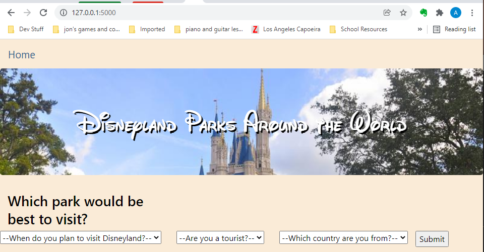

# disneyland_review_analysis
[Link to Tableau Dashboard](https://public.tableau.com/views/DisneyReviewsAnalysis/Story1?:language=en-US&:display_count=n&:origin=viz_share_link)

<div align="center">

</div>
  
## Overview

### The Data


I perform an exploratory analysis of a large dataset- over 41,000 reviews of three different Disneyland parks.  These reviews, taken from TripAdvisor and compiled [here](https://www.kaggle.com/arushchillar/disneyland-reviews), provide:

  - Review_ID, a unique ID
  - Rating, from 1-5
  - Year_Month, date of visit
  - Review_Location, the country of the reviewer's account
  - Review_Text, the content of the review
  - Disneyland_Branch, which park was visited and evaluated

I later add five more features:
  - Year, split from Year_Month
  - Month, split from Year_Month
  - Review_Words, the word count of the review
  - Review_Letters, the character count of the review
  - Tourist, a binary metric based on many assumptions. 
    - A 0 signifies a "local", someone who visited the park in the same country from which they reviewed.  
    - If these two locations were different, this metric is a 1, signifying "tourist."  (It is important to note those from the United States visiting Anaheim, California would still count as "locals" in this code, even if they are visiting from New York or Florida, thousands of miles away.)

### The Tools

I use **Jupyter Notebook**, **Pandas**, and **Python** to manipulate and clean the data.

I upload the cleaned data to **pgAdmin** to have an easily accessible **postgres** database.  I also save a copy as a CVS file.

I use **Tableau** to visualize the patterns and trends in the data.

I train a **balanced random forest classifier** machine learning model to predict which park one would most enjoy visiting.

I use **Flask**, **html**, and **css** to allow easy interaction with this model.

## Results
The charts and graphs below can be found in the following **[link to Tableau Dashboard](https://public.tableau.com/views/DisneyReviewsAnalysis/Story1?:language=en-US&:display_count=n&:origin=viz_share_link)**.


## Machine Learning

For a machine learning project, I thought it would be interesting to create a model which could recomment which Disneyland park one should visit between the three options, Paris, Hong Kong, and California.

I used a balanced random forest model with five features:
<ul>
  <li> Rating (1-5)</li>
  <li> Month</li>
  <li> Year</li>
  <li> Tourist</li>
  <li> Location</li>
</ul>

Reviewer ID was a unique value, not relevant to predicting park, and the review content did not seem to be viable input data.

```
# Create our features
X = disney_clean_df[["Rating", "Month", "Year", "Tourist", "Location_Encoded"]]

# Create our target
y = disney_clean_df['Branch_Encoded']
```

Rating we assume to be 5 (we want our subject to have a good time), and the year we assume to be 2022 (assuming our subject is planning for a trip next year).

So we are left with 3 inputs into our model:  Month, Tourist, and Location.


